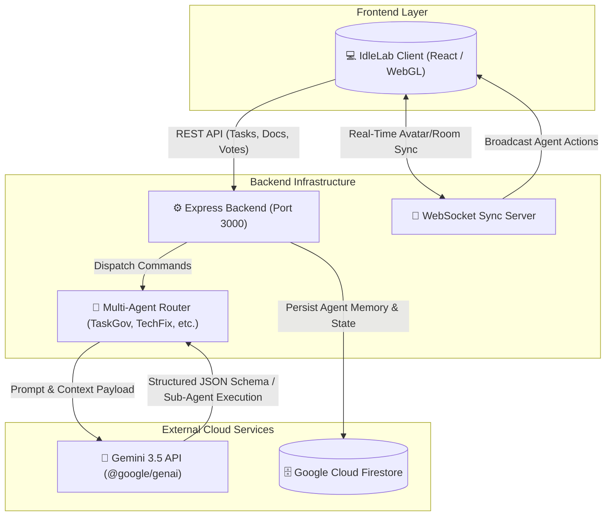

 **IdleLab© — Autonomous 3D Agentic Spatial Virtual Office Workspace** 

**Developed by:** Benz-Carlton 
**Contact:** benzcarltonheinz@gmail.com  
**Test Link:** [idleLab AI Studio](https://idlelab-benzcarlton.ai.studio/)
**Creation Date:** August 27th 2026 
**IdleLab** is an interactive, spatial 3D WebGL virtual office workspace powered by an autonomous multi-agent cloud architecture. Driven by **Gemini 3.5 Flash**, the `@google/genai` TypeScript SDK, and **Google Cloud Firestore**, IdleLab transforms distributed remote work into a dynamic, real-time collaboration ecosystem where autonomous AI colleagues handle document orchestration, meeting facilitation, code governance, and workplace wellness.

---

## 🏛️ Systemic Agentic Cloud Logic & Architecture

IdleLab is engineered with an enterprise-grade cloud-native multi-agent architecture combining real-time bidirectional WebSocket synchronization, server-side Gemini orchestration, and Google Cloud Firestore persistence.



### 1. Cloud Agent Control Bus (`/api/agent-command`)
- **Centralized Dispatching:** External clients, automated CI/CD webhooks, or workspace users dispatch structured actions (`NAVIGATE_TO_DESK`, `PROJECT_DISPLAY`, `START_MEETING`, `SUMMARIZE_DOCUMENT`, `CONDUCT_VOTE`, `SET_MOOD_AUDIO`, `EXECUTE_SUB_AGENT`).
- **Google Cloud Firestore Persistence:** Every agent interaction, tool invocation, and decision path is logged to the `agent_memory` collection via `logAgentActivity`, preserving context across sessions.
- **WebSocket Broadcast (`CLOUD_AGENT_COMMAND`):** Synchronizes agent actions across all connected 3D spatial clients in real time.

---

## 🤖 Chloe Becker — Primary Executive AI Agent & Orchestrator

Located at the **B1 Executive Data Center & Theater**, **Chloe Becker** is an autonomous AI colleague equipped with contextual awareness, real-time spatial head tracking, and a specialized fleet of 5 sub-agents:

### The 5 Specialized Sub-Agents:
1. **🛡️ TaskGov (Task Governance & Accountability Lead):**
   - Validates sprint milestones and predicts roadmap delivery dates.
   - Generates automated, itemized rubric grading criteria with XP and salary token rewards.
2. **🤝 CultureMatch (Workplace Culture & Team Alignment Specialist):**
   - Resolves cross-functional jargon, slang, and cultural misunderstandings using the *Define → Search → Discuss* framework.
   - Enforces psychological safety and team harmony metrics.
3. **⚡ TechFix (Technical Architecture & Diagnostics Supervisor):**
   - Monitors live client/server telemetry and diagnostic logs.
   - Automatically formats bug reports and generates structured debug payloads for Gemini.
4. **🧘 WisdomWell (Executive Strategic Wisdom & Health Coach):**
   - Tracks screen time and triggers ergonomic hydration / Pomodoro breaks every 30 minutes.
   - Provides strategic executive decision coaching and burn-out prevention.
   - Operates a non-intrusive hydration reminder engine with customizable intervals (default 5-minute alerts) directly configurable in Settings.
5. **⚙️ WorkspaceAutomator (Workflow Execution Specialist):**
   - Extracts actionable tasks from transcripts and meeting discussions.
   - Synchronizes shared team checklists and generates concise end-of-meeting summaries.

### Spatial Awareness & Voice Synthesis:
- **Proximity Gaze Engine:** Uses vector arithmetic to calculate yaw/pitch relative to the player, maintaining Pixar-style eye contact and blinking.
- **Neural TTS:** Powered by **ElevenLabs Multilingual v2** (`EXAVITQu4vr4xnSDxMaL`) with instant fallback to the Web Speech API.
- **Multilingual Support:** Live translation across English (`en-US`), Chinese (`zh-CN`), Spanish (`es-ES`), Japanese (`ja-JP`), French (`fr-FR`), and German (`de-DE`).

---

## 💼 Claire Wang — 2F Executive Boardroom Facilitator

Situated in the **2nd Floor Executive Boardroom**, **Claire Wang** directs formal organizational governance:
- **8K Screen Stream Interception:** Analyzes live presenter slide decks and meeting transcripts.
- **Participant Alignment Scorecard (0–100):** Evaluates presentation clarity and partnership suitability.
- **Consensus Voting Pipeline:** Orchestrates real-time board member ballots (Approve, Revise, Reject) and records official meeting minutes.

---

## 🚀 Multiworkspace Tab & Integration Suite

The **AgentFlow Multiworkspace Modal** is the central productivity hub:
- **6 Persona Categories:** Instant configuration for *Remote Work*, *Academic Research*, *Content Creation*, *Forum Moderation*, *Small Business*, and *Live Streaming*.
- **Cross-Session Document Analysis:** Attach markdown, PDF, or text files for instant AI document ingestion and contextual querying.
- **Live System Telemetry:** Inspect sub-agent execution logs, tool invocations, and token latency.
- **Interactive Task Checklist:** Add, complete, and delete sprint goals with automatic local storage and cloud persistence.
- **Gamified Level & XP Progression:** Earn experience points, salary credits, and achievement badges for passing automated Chloe grading rubrics.

---

## 🎮 3D Spatial Environment & Physical Mechanics

- **Basement B1:** Chloe Becker's AI Data Center, 8-Server Rack Cluster, and Championship Tennis Court (with Dolly Bot, Fireball Smashes, Topspin physics, and Wall Scoreboards).
- **1st Floor (Main Floor):** Open-plan developer workstations, Barista Coffee Robot, Ping Pong table arena, and Whiteboard brainstorm area.
- **2nd Floor:** Executive Boardroom with Claire Wang, 12-seat conference table, presentation projectors, and voting terminals.
- **3rd Floor:** Sunlight Study Cafe, rooftop glass garden, ambient study soundscapes, and relaxing focus stations.
- **Kinematic Rule Enforcement:**
  - Avatar ping pong paddle is strictly restricted to the 1st Floor table zone.
  - Avatar tennis racquet and swing animations are strictly restricted to the B1 Tennis Court.

---

## 🛠️ Devpost "Setme" Quickstart Instructions

Follow these step-by-step instructions to configure, run, and test IdleLab locally or in the cloud:

### 1. Prerequisites
- **Node.js:** v18.0.0 or higher
- **npm** or **bun** package manager
- **Google Gemini API Key** (obtain free from [Google AI Studio](https://aistudio.google.com/))
- **Google Cloud / Firebase Project** (Firestore enabled)

### 2. Configure Environment (`.env`)
Create a `.env` file in the project root directory with your credentials:

```env
# Google Gemini API Key (Required for Multi-Agent Orchestration)
GEMINI_API_KEY=your_gemini_api_key_here

# Firebase / Google Cloud Firestore Configuration (Required for Persistence)
VITE_FIREBASE_API_KEY=your_firebase_api_key
VITE_FIREBASE_AUTH_DOMAIN=your_project_id.firebaseapp.com
VITE_FIREBASE_PROJECT_ID=your_project_id
VITE_FIREBASE_STORAGE_BUCKET=your_project_id.appspot.com
VITE_FIREBASE_MESSAGING_SENDER_ID=your_messaging_sender_id
VITE_FIREBASE_APP_ID=your_app_id

# ElevenLabs TTS Configuration (Optional - Falls back to Web Speech API)
VITE_ELEVENLABS_API_KEY=your_elevenlabs_key_here
```

### 3. Install Dependencies
```bash
npm install
```

### 4. Run Development Server
```bash
npm run dev
```
The application will launch on **http://localhost:3000** (or http://0.0.0.0:3000).

### 5. Production Build & Start
```bash
# Build the Vite frontend and bundle server.ts via esbuild
npm run build

# Start the compiled production server
npm start
```

---

## 🗺️ Guided Tour for Judges & Reviewers

Controls & Navigation:

controlsAndNavigation: [
    controlsAndNavigation: [
    "1. Use WASD keys or click your mouse in any direction to move your avatar smoothly around the office",
    "2. Click and drag your mouse to rotate and adjust your camera view, just like Roblox",
    "3. Press E on any floor to instantly hop on a scooter for a fast joy ride across the map",
    "4. Avatar Customization: Click on settings inside the navigation tool to customize your avatar's appearance to your liking",
    "5. To test Claire Wang as your collaborative assistant, go to the 2nd floor (2F) and wave at her"
    "6. 🎾 Tennis Court Tip: When playing at the tennis court on Floor 3, press the **Spacebar** if you want to smash the ball!
    "7. Use the navigation toolbar to click the left and right panels to open the Pages & Layers view, which displays building floors and workspace integration shortcuts.
    
**Floor Tour:**

* **Floor B1: Corporate Workspace, Manager's office, and Tennis Court (NPC Chloe Becker)**
  * Explore the server rack cluster and task center.

* **Floor 1: Executive Boardroom Suite **
  * The starting zone where you spawn directly into the virtual workspace upon login.

* **Floor 2: Meeting Room & Claire Wang ( 💡 NPC Claire Wang)**
  * Meet Claire Wang from the second floor. Approach or wave at her to initialize presentation streams, view participant alignment scores, conduct executive votes, and cast live camera feeds or external tabs onto office monitors.

* **Floor 3: Visitor Center Cafe**
  * A scenic lounge for online coffee chats featuring an interactive tennis court to play on while waiting for meeting guests.


YouTube demo:
https://www.youtube.com/watch?v=SgWQh31mK54&list=PLfc0E4QM5zvA&index=1
  
